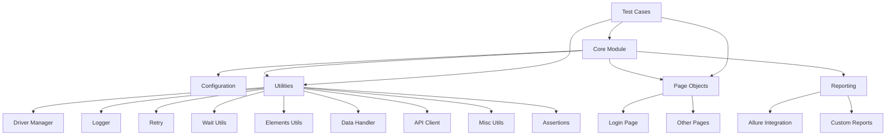

# Architecture Overview

This document outlines the architecture of the Test Automation Framework, explaining the design principles, module interactions, and implementation details.

## Design Principles

The framework follows SOLID principles to ensure maintainability, scalability, and reusability:

1. **Single Responsibility Principle**: Each module has a well-defined purpose and responsibility.
2. **Open/Closed Principle**: Modules are open for extension but closed for modification.
3. **Liskov Substitution Principle**: Derived classes can substitute their base classes without affecting functionality.
4. **Interface Segregation Principle**: Clients aren't forced to depend on interfaces they don't use.
5. **Dependency Inversion Principle**: High-level modules don't depend on low-level modules; both depend on abstractions.

## System Architecture

The framework consists of several interconnected modules organized in a layered architecture:

## Module Descriptions

### Core Module

The Core Module (`core.py`) serves as the entry point and coordinator for the framework. It:

- Initializes the framework configuration
- Sets up logging
- Provides the main execution flow
- Integrates with test runners

### Configuration Module

The Configuration Module (`config.py`) centralizes framework settings. It:

- Loads settings from JSON configuration files
- Supports environment variable overrides
- Provides default values for missing configuration
- Validates configuration parameters

### Utilities

#### Driver Manager

The Driver Manager (`driver_manager.py`) handles browser interactions. It:

- Initializes WebDriver instances with appropriate configurations
- Supports multiple browsers (Chrome, Firefox)
- Manages WebDriver lifecycle
- Configures headless mode for CI/CD environments

#### Logger

The Logger (`logger.py`) provides centralized logging. It:

- Creates formatted logs with timestamps
- Supports both console and file outputs
- Configurable log levels
- Thread-safe implementation

#### Retry Mechanism

The Retry Mechanism (`retry.py`) handles transient failures. It:

- Implements a decorator for retry logic
- Supports configurable retry attempts, delays, and backoff
- Logs retry attempts for debugging

#### Wait Utilities

The Wait Utilities (`wait_utils.py`) manage synchronization. They:

- Provide explicit waits for element conditions
- Handle timeouts gracefully
- Support custom waiting conditions
- Integrate with logging for traceability

#### Elements Utilities

The Elements Utilities (`elements_utils.py`) encapsulate element interactions. They:

- Provide wrappers for common Selenium operations
- Integrate with wait utilities for reliable interactions
- Include better error handling and logging
- Support advanced UI operations (drag-and-drop, hover)

#### Data Handler

The Data Handler (`data_handler.py`) manages test data. It:

- Loads test data from JSON and CSV files
- Generates random test data for data-driven testing
- Provides data manipulation functions
- Supports data persistence

#### API Client

The API Client (`api_client.py`) handles API testing. It:

- Wraps HTTP requests with better error handling
- Supports authentication workflows
- Includes retry logic for network issues
- Provides response validation

#### Miscellaneous Utilities

The Miscellaneous Utilities (`misc_utils.py`) provide additional helpers. They:

- Handle screenshot capture
- Provide date/time utilities
- Include file operations helpers
- Support system information collection

#### Assertions

The Assertions module (`assertions.py`) provides custom test assertions. It:

- Extends standard assertions with better error messages
- Includes UI-specific assertions
- Supports soft assertions for multiple validations

### Page Objects

Page Objects encapsulate web page interactions. They:

- Separate page structure from test logic
- Store element locators
- Provide high-level page actions
- Follow the Page Object Model design pattern

### Reporting

The Reporting Module (`reporting.py`) generates test reports. It:

- Integrates with Allure for rich reporting
- Captures screenshots on test failures
- Provides execution metrics
- Generates HTML reports

## Data Flow

1. Test cases invoke the framework through the Core Module
2. Core Module loads configuration and initializes components
3. Test cases use Page Objects to interact with the application
4. Page Objects use Utilities to perform actions
5. Results are captured by the Reporting Module
6. Test assertions verify expected outcomes

## Extension Points

The framework can be extended in several ways:

- Adding new Page Objects for new application screens
- Implementing new Utility modules for specific needs
- Extending the Reporting Module with new report types
- Customizing the Configuration Module for project-specific settings
- Adding custom test listeners for special test events

## Implementation Guidelines

When implementing test cases with this framework, follow these guidelines:

1. Create Page Objects for each application screen
2. Use the Data Handler for test data management
3. Implement proper waits and error handling
4. Structure tests in a BDD fashion (Given-When-Then)
5. Utilize reporting annotations for comprehensive reports
6. Follow test isolation best practices

## Performance Considerations

The framework includes several optimizations:

- Smart waiting strategies to reduce test execution time
- Resource cleanup to minimize memory usage
- Parallel test execution support
- Optimized WebDriver initialization

## Security Considerations

When using the framework, consider these security aspects:

- Store sensitive test data securely (not in version control)
- Use environment variables for credentials
- Implement secure handling of authentication tokens
- Clear sensitive data after test execution

The test automation framework is organized into several key components under the `pulseq` namespace:

- `pulseq.core`: The core test runner and execution engine
- `pulseq.config`: Configuration management and settings
- `pulseq.page_objects`: Page object models for web UI testing
- `pulseq.utilities`: Common utility functions and helpers
