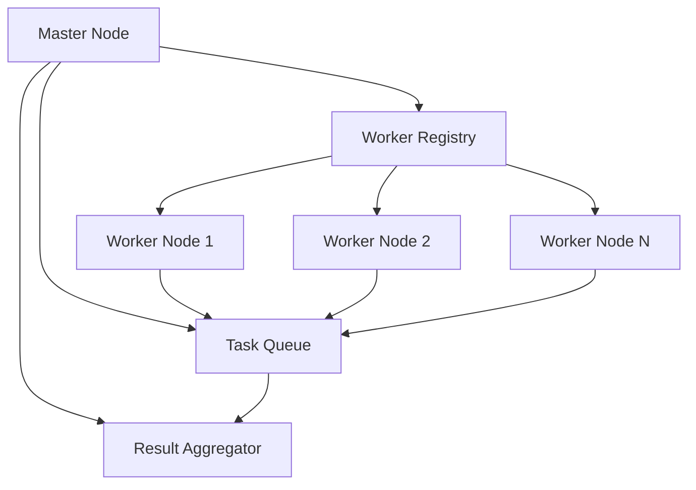
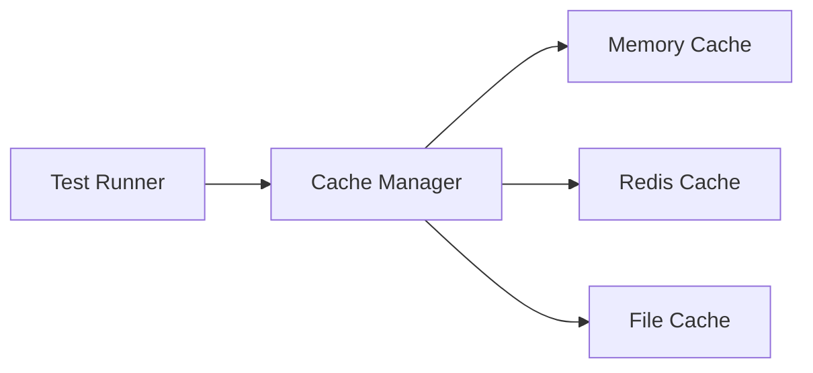

# Technical Specifications for Phase 3 Features

## 1. Distributed Testing System

### Architecture Overview



### Components

#### Master Node

- **Responsibilities**:
  - Task distribution
  - Worker management
  - Result aggregation
  - Health monitoring
- **Technologies**:
  - Node.js with TypeScript
  - Redis for task queue
  - MongoDB for result storage
  - WebSocket for real-time communication

#### Worker Node

- **Responsibilities**:
  - Test execution
  - Resource monitoring
  - Result reporting
  - Health reporting
- **Technologies**:
  - Node.js with TypeScript
  - Docker for isolation
  - Resource monitoring tools

### API Specifications

#### Worker Registration

```typescript
interface WorkerRegistration {
  id: string;
  capabilities: string[];
  resources: {
    cpu: number;
    memory: number;
    disk: number;
  };
  status: "idle" | "busy" | "offline";
}
```

#### Task Distribution

```typescript
interface TestTask {
  id: string;
  type: "graphql" | "rest" | "performance";
  priority: number;
  dependencies: string[];
  timeout: number;
  retryCount: number;
}
```

## 2. Cloud Integration Framework

### Supported Providers

- AWS
- GCP
- Azure

### Core Components

#### Cloud Resource Manager

```typescript
interface CloudResource {
  provider: "aws" | "gcp" | "azure";
  type: "ec2" | "gce" | "vm";
  configuration: {
    instanceType: string;
    region: string;
    tags: Record<string, string>;
  };
}
```

#### Authentication System

```typescript
interface CloudCredentials {
  provider: string;
  accessKey: string;
  secretKey: string;
  region: string;
}
```

### Integration Points

#### AWS Integration

- EC2 instance management
- S3 storage for test artifacts
- CloudWatch for monitoring
- IAM for access control

#### GCP Integration

- Compute Engine management
- Cloud Storage for artifacts
- Stackdriver for monitoring
- IAM for access control

#### Azure Integration

- VM management
- Blob Storage for artifacts
- Azure Monitor for monitoring
- RBAC for access control

## 3. Caching System

### Architecture



### Cache Types

1. **Memory Cache**

   - Fast access
   - Limited size
   - Volatile storage

2. **Redis Cache**

   - Distributed
   - Persistent
   - High availability

3. **File Cache**
   - Large objects
   - Long-term storage
   - Cost-effective

### Cache Strategies

```typescript
interface CacheStrategy {
  type: "memory" | "redis" | "file";
  ttl: number;
  maxSize: number;
  evictionPolicy: "lru" | "fifo" | "random";
}
```

## 4. Multi-Environment Testing

### Environment Types

1. **Development**

   - Local resources
   - Mock services
   - Fast feedback

2. **Staging**

   - Production-like
   - Limited scale
   - Integration testing

3. **Production**
   - Full scale
   - Real services
   - Performance testing

### Environment Configuration

```typescript
interface EnvironmentConfig {
  name: string;
  type: "dev" | "staging" | "prod";
  services: {
    [key: string]: {
      url: string;
      credentials?: Record<string, string>;
    };
  };
  resources: {
    cpu: number;
    memory: number;
    storage: number;
  };
}
```

## 5. Real-time Monitoring

### Metrics Collection

```typescript
interface Metric {
  name: string;
  value: number;
  timestamp: Date;
  tags: Record<string, string>;
}
```

### Alert System

```typescript
interface AlertRule {
  metric: string;
  condition: "gt" | "lt" | "eq";
  threshold: number;
  duration: number;
  severity: "info" | "warning" | "critical";
}
```

### Dashboard Components

1. **Performance Metrics**

   - Response times
   - Throughput
   - Error rates
   - Resource usage

2. **Test Coverage**

   - Pass/fail rates
   - Test duration
   - Coverage percentage
   - Skipped tests

3. **Resource Monitoring**
   - CPU usage
   - Memory usage
   - Disk I/O
   - Network traffic

## Implementation Guidelines

### Code Organization

```
src/
├── distributed/
│   ├── master/
│   ├── worker/
│   └── common/
├── cloud/
│   ├── aws/
│   ├── gcp/
│   └── azure/
├── cache/
│   ├── memory/
│   ├── redis/
│   └── file/
├── environment/
│   ├── config/
│   ├── manager/
│   └── templates/
└── monitoring/
    ├── metrics/
    ├── alerts/
    └── dashboard/
```

### Testing Strategy

1. **Unit Tests**

   - Component-level testing
   - Mock external dependencies
   - 90% coverage requirement

2. **Integration Tests**

   - Cross-component testing
   - Real external services
   - End-to-end scenarios

3. **Performance Tests**
   - Load testing
   - Stress testing
   - Scalability testing

### Security Considerations

1. **Authentication**

   - JWT tokens
   - OAuth2 integration
   - Role-based access

2. **Data Protection**

   - Encryption at rest
   - Encryption in transit
   - Secure credential storage

3. **Audit Logging**
   - Action tracking
   - Change history
   - Security events

### Deployment Strategy

1. **Containerization**

   - Docker images
   - Kubernetes deployment
   - Helm charts

2. **CI/CD Pipeline**

   - Automated testing
   - Version control
   - Release management

3. **Monitoring**
   - Health checks
   - Performance metrics
   - Error tracking
